## Description 
This is an Android application developed with Java that enables users to place service requests to selected service providers. There are two sides of the app, the Customer side and the Provider side, each with their own database (Firebase Firestore). To use this app download the apk file from here. You will need a android device or an emulator to run the file. 

### Customer Section (Login as Customer)

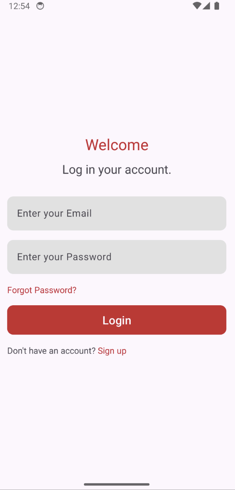
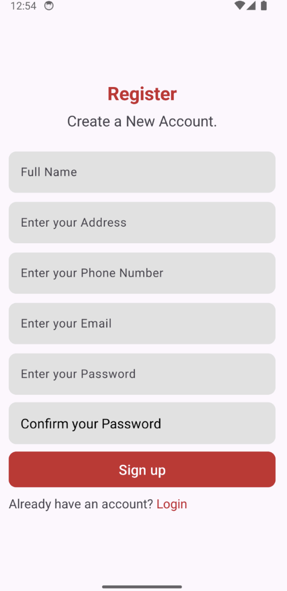
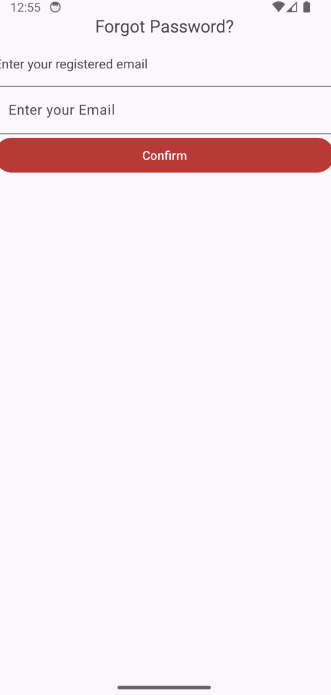
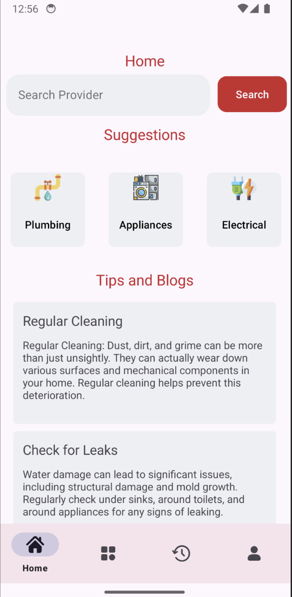

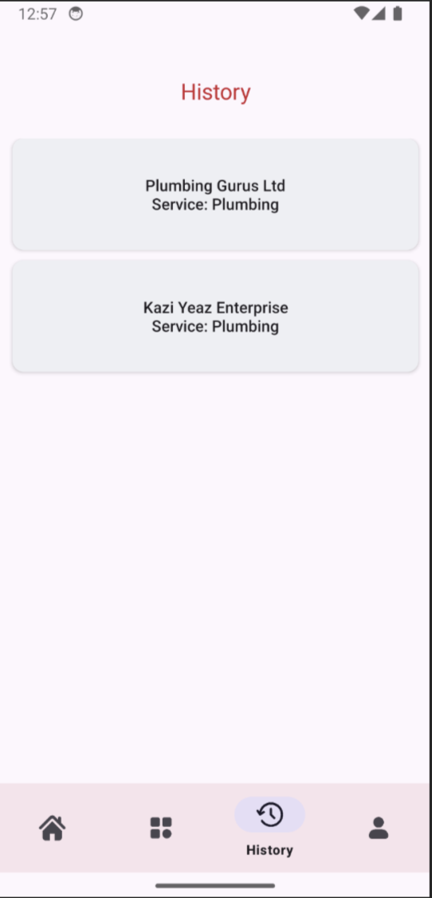
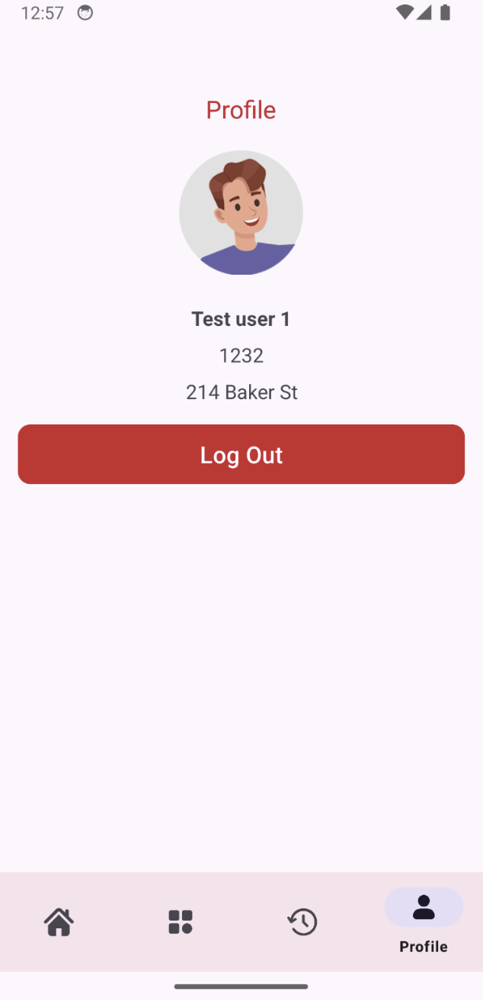
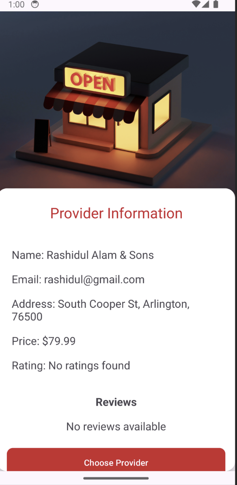
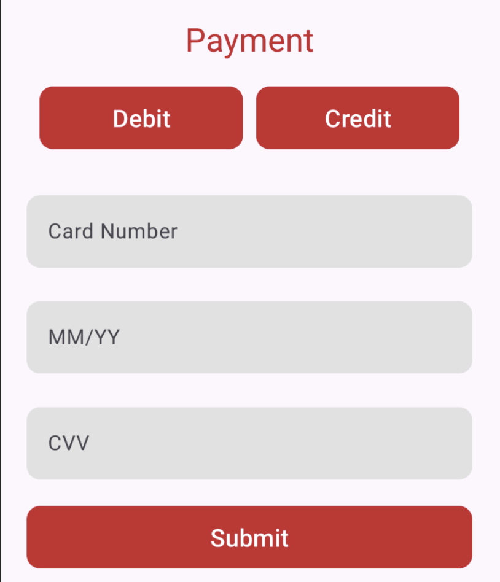

### Provider Side of the App (Login as Provider)
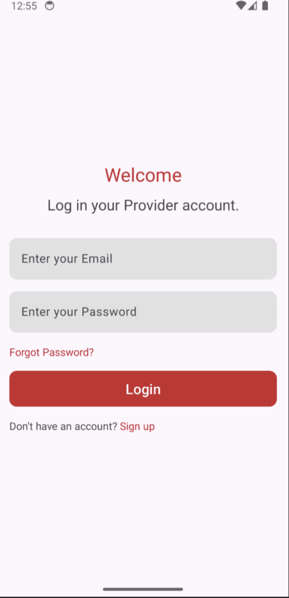
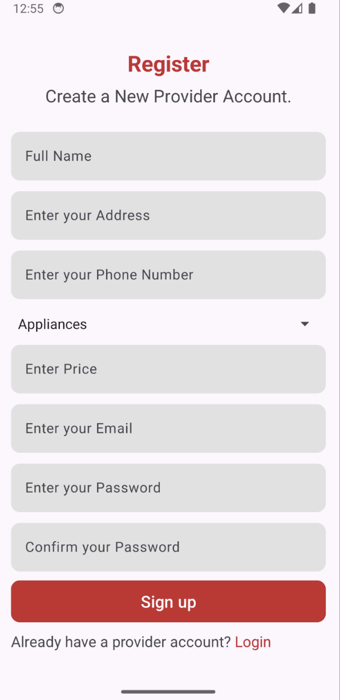
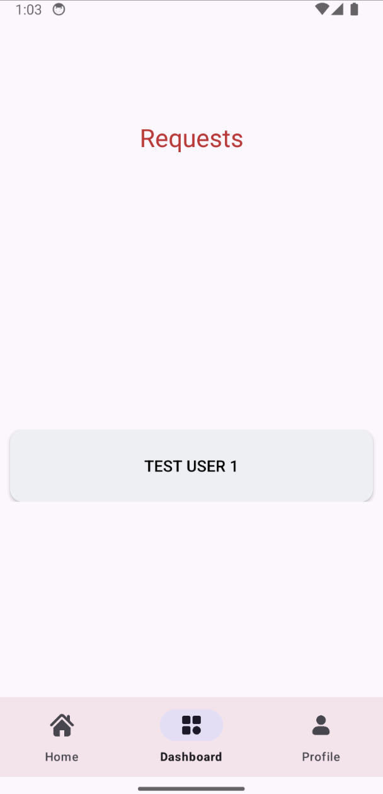
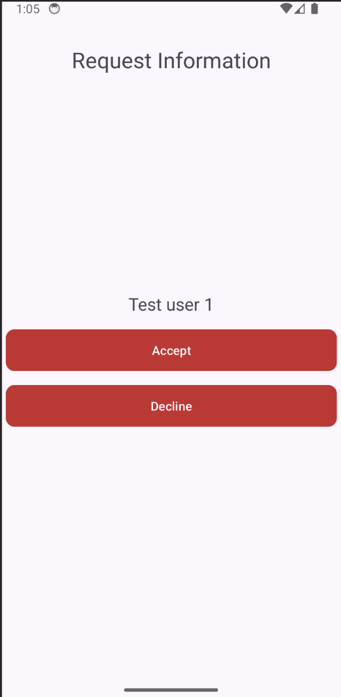
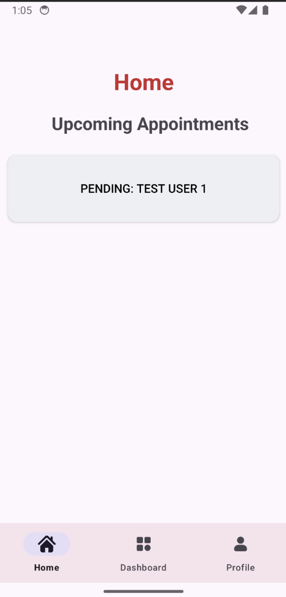

